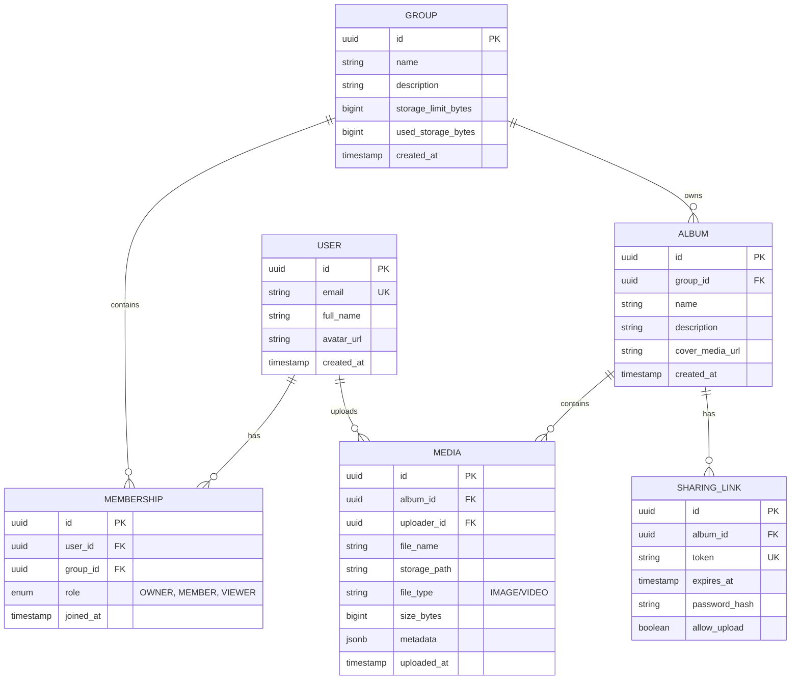

# 🗄️ Database Design

This document outlines the relational schema for Memora, optimized for PostgreSQL.

---

## 1. Entity Relationship Diagram (ERD)



---

## 2. Table Specifications

### 2.1 Table: `users`

Persists user data harvested from Google OAuth.

| Column       | Type           | Constraints        | Description                     |
| :----------- | :------------- | :----------------- | :------------------------------ |
| `id`         | `UUID`         | `PRIMARY KEY`      | Unique identifier.              |
| `email`      | `VARCHAR(255)` | `UNIQUE, NOT NULL` | Google account email.           |
| `full_name`  | `VARCHAR(255)` | `NOT NULL`         | Display name.                   |
| `avatar_url` | `TEXT`         |                    | Link to Google profile picture. |
| `created_at` | `TIMESTAMP`    | `DEFAULT NOW()`    | Account creation time.          |

### 2.2 Table: `groups`

The container for shared storage and collaboration.

| Column                | Type           | Constraints     | Description               |
| :-------------------- | :------------- | :-------------- | :------------------------ |
| `id`                  | `UUID`         | `PRIMARY KEY`   |                           |
| `name`                | `VARCHAR(100)` | `NOT NULL`      | Group name.               |
| `description`         | `TEXT`         |                 |                           |
| `storage_limit_bytes` | `BIGINT`       | `NOT NULL`      | Max capacity (e.g., 5GB). |
| `used_storage_bytes`  | `BIGINT`       | `DEFAULT 0`     | Current usage sum.        |
| `created_at`          | `TIMESTAMP`    | `DEFAULT NOW()` |                           |

### 2.3 Table: `memberships`

Defines who belongs to which group and their permission level.

| Column      | Type          | Constraints                                     | Description           |
| :---------- | :------------ | :---------------------------------------------- | :-------------------- |
| `id`        | `UUID`        | `PRIMARY KEY`                                   |                       |
| `user_id`   | `UUID`        | `FK -> users(id)`                               |                       |
| `group_id`  | `UUID`        | `FK -> groups(id)`                              |                       |
| `role`      | `VARCHAR(20)` | `CHECK (role IN ('OWNER', 'MEMBER', 'VIEWER'))` | Simplified role enum. |
| `joined_at` | `TIMESTAMP`   | `DEFAULT NOW()`                                 |                       |

### 2.4 Table: `albums`

Categorical folders within a group.

| Column            | Type           | Constraints        | Description                             |
| :---------------- | :------------- | :----------------- | :-------------------------------------- |
| `id`              | `UUID`         | `PRIMARY KEY`      |                                         |
| `group_id`        | `UUID`         | `FK -> groups(id)` | Must belong to a group.                 |
| `name`            | `VARCHAR(100)` | `NOT NULL`         |                                         |
| `description`     | `TEXT`         |                    |                                         |
| `cover_media_url` | `TEXT`         |                    | URL of the thumbnail to show on folder. |
| `created_at`      | `TIMESTAMP`    | `DEFAULT NOW()`    |                                         |

### 2.5 Table: `media`

Individual media assets (Photos/Videos).

| Column         | Type           | Constraints                               | Description               |
| :------------- | :------------- | :---------------------------------------- | :------------------------ |
| `id`           | `UUID`         | `PRIMARY KEY`                             |                           |
| `album_id`     | `UUID`         | `FK -> albums(id)`                        |                           |
| `uploader_id`  | `UUID`         | `FK -> users(id)`                         | Who uploaded it.          |
| `file_name`    | `VARCHAR(255)` | `NOT NULL`                                | Original filename.        |
| `storage_path` | `TEXT`         | `NOT NULL`                                | Key in MinIO.             |
| `file_type`    | `VARCHAR(10)`  | `CHECK (file_type IN ('IMAGE', 'VIDEO'))` |                           |
| `size_bytes`   | `BIGINT`       | `NOT NULL`                                | Used for storage billing. |
| `metadata`     | `JSONB`        |                                           | EXIF/GPS/Device data.     |
| `uploaded_at`  | `TIMESTAMP`    | `DEFAULT NOW()`                           |                           |

### 2.6 Table: `sharing_links`

External access tokens.

| Column          | Type           | Constraints        | Description            |
| :-------------- | :------------- | :----------------- | :--------------------- |
| `id`            | `UUID`         | `PRIMARY KEY`      |                        |
| `album_id`      | `UUID`         | `FK -> albums(id)` |                        |
| `token`         | `VARCHAR(64)`  | `UNIQUE, NOT NULL` | Secure random string.  |
| `expires_at`    | `TIMESTAMP`    |                    | Optional expiration.   |
| `password_hash` | `VARCHAR(255)` |                    | Optional PIN/Password. |
| `allow_upload`  | `BOOLEAN`      | `DEFAULT FALSE`    | Enables Guest uploads. |

---

## 3. Database Constraints & Logic

### 3.1 Composite Indexes

- `CREATE INDEX idx_media_album ON media(album_id);` (Fast gallery load)
- `CREATE INDEX idx_membership_lookup ON memberships(user_id, group_id);` (Fast auth check)
- `CREATE UNIQUE INDEX idx_unique_membership ON memberships(user_id, group_id);` (Prevent double join)

### 3.2 Storage Tracking Trigger (Conceptual)

To keep `groups.used_storage_bytes` accurate without heavy `SUM()` queries:

```sql
-- When media is inserted
UPDATE groups SET used_storage_bytes = used_storage_bytes + NEW.size_bytes
WHERE id = (SELECT group_id FROM albums WHERE id = NEW.album_id);

-- When media is deleted
UPDATE groups SET used_storage_bytes = used_storage_bytes - OLD.size_bytes
WHERE id = (SELECT group_id FROM albums WHERE id = OLD.album_id);
```

### 3.3 Deletion Policy

- **Groups:** Cascades to `memberships`, `albums`, and `media`. _Warning: Files in MinIO must be cleaned up manually by the application layer._
- **Albums:** Cascades to `media` and `sharing_links`.
